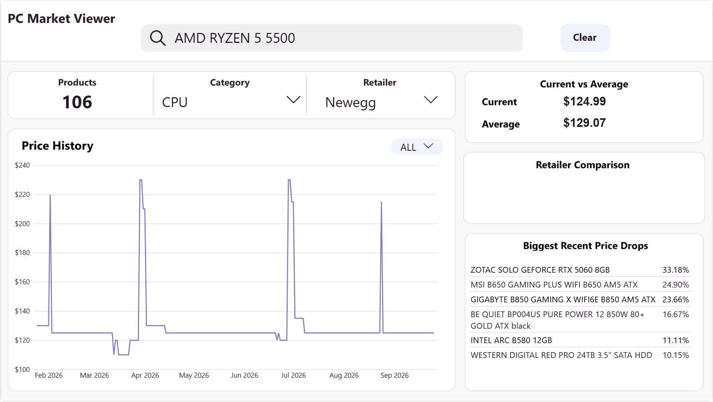
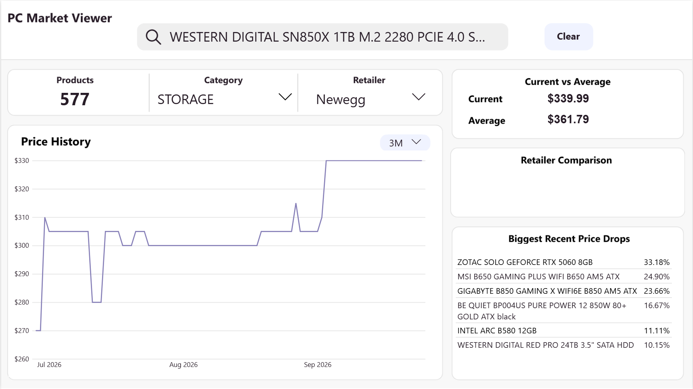

# PC Market Viewer

An educational data engineering project that collects PC component prices,
normalizes product metadata, matches products over time, and stores the results
in BigQuery for historical analysis.

The pipeline currently runs daily through Dagster and GitHub Actions. Its main
source is Newegg Canada.

## Current Architecture

```text
Newegg Canada
      |
      v
    scraper
      |
      v
Dagster assets
      |
      +--> raw prices
      +--> cleaned prices
      +--> category-specific product attributes
      +--> product embeddings and vector matching
      |
      v
BigQuery Warehouse (star schema)
      |
      v
 SQL Analytics
      |
      v
   Power BI
```

## Implemented Features

### Extraction

- Scrapes CPUs, GPUs, motherboards, memory, PSUs, and storage.
- Records product name, price, retailer, category, timestamp, and source URL.
- Supports scheduled daily ingestion through Dagster and GitHub Actions.

### Transformation

- Cleans prices, names, timestamps, URLs, and duplicate observations.
- Extracts category-specific attributes from product titles.
- Supports CPU, GPU, memory, motherboard, PSU, and storage schemas.
- Generates stable product keys from normalized product attributes.
- Flags records that need review when metadata extraction is incomplete.

### Warehouse Model

The pipeline uses a shared BigQuery star-schema model:

- `dim_products`: product name, brand, category, and embedding.
- `dim_*_specs`: category-specific product attributes.
- `dim_retailers`: retailer name, domain, country.
- `fact_prices`: historical price observations by product and retailer.
- `fact_vector_search`: product matching confidence, method, and approval state.

Raw and intermediate data are also retained within the pipeline to provide
traceabliliy between extraction and transformed data.

### Product Matching

- Loads the embedding model once per Python process with `lru_cache`.
- Generates normalized product embeddings.
- Uses BigQuery vector search to match incoming listings against existing products.
- Stores matching metadata for review and validation.
- Allows recurring listings to be associated with the same product across price observations.

### Orchestration and Automation

- Dagster assets are grouped by component category and pipeline stage.
- `daily_etl_job` selects the complete set of pipeline assets.
- GitHub Actions runs the ingestion pipeline daily and supports manual executions.

## Data Flow

1. Scrape raw Newegg listings.
2. Clean and validate common price fields.
3. Extract product names and category specifications.
4. Generate product keys and embeddings.
5. Match incoming products against existing BigQuery products.
6. Separate product, specification, price, retailer, and matching data into warehouse tables.
7. Append the current price observations to fact_prices
8. Run SQL analytics against the historical pricing data.
9. Visualize market trends and price changes in Power BI.

## Analytics and Power BI

The project includes a dedicated analytics layer on top of the BigQuery warehouse.

### SQL Analytics
The `analytics/` directory contains reusable SQL queries for preparing data for analysis:

- `price_history.sql` — creates the historical price view used to analyze product prices over time.
- `daily_product_prices.sql` — prepares daily product price data for identifying significant day-to-day price changes.

Additional calculations and interactive measures are handled in Power BI using DAX.

### Power BI Dashboard

The resulting dataset is connected to Power BI to provide an interactive view of the PC component market.

The dashboard currently includes analysis such as:

- Historical product price trends
- Current prices and price changes
- Largest recent price drops
- Product/category filtering
- Retailer and product comparisons (retailer comparison will be added in the future)
- Interactive date and category analysis

### Dashboard Preview





The dashboard provides a user-facing analytics layer on top of the same BigQuery data warehouse used by the pipeline.

## Project Goals

The project is designed to explore how a real-world data pipeline can turn frequently changing retail listings into a structured historical dataset suitable for analytics.

The current system focuses on:

- Reliable daily data ingestion
- Product normalization and entity matching
- Historical price tracking
- Cloud data warehousing
- SQL-based analytics
- Interactive business intelligence through Power BI

Future work may extend the platform with additional retailers, APIs, and AI-powered analysis over the historical product and pricing data.